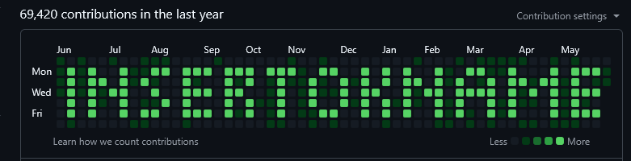

# un editor de istorie care iti da puterea sa fii eminescu cu commit urile slash istoria de pe github

# aka (uedicidpsfeccusidpg)

Used to generate contribution history art. This can also generate exact total profile commits.



Basic usage: First download `un-editor-de-istorie-care-iti-da-puterea-sa-fii-eminescu-cu-commit-urile-slash-istoria-de-pe-github.py` from this git repo, after that, using a pattern file (.uedicidpsfeccusidpg, for example checkout `pattern.uedicidpsfeccusidpg`). Generate a new git repo by specifying the `-o {OUTPUT_LOCATION}` flag. You can then push that to your github account. I recomend using `gh repo create --public --push --source=.` to push your repo to github and `gh repo delete --yes` to delete it.

example usage:
```
py .\un-editor-de-istorie-care-iti-da-puterea-sa-fii-eminescu-cu-commit-urile-slash-istoria-de-pe-github.py .\pattern.uedicidpsfeccusidpg -o "github-history-art" --commits-per-pixel 20
```

This will make a repository with the pixel art with 20 commits per pixel.

If you instead wish to achieve a certain commit count you can use the `--total-commit-count` flag instead of `--commits-per-pixel`. You should also probably use the `--user` flag when using `--total-commit-count`. 

For example this is how I can achieve 69420 commits:
```
py .\un-editor-de-istorie-care-iti-da-puterea-sa-fii-eminescu-cu-commit-urile-slash-istoria-de-pe-github.py .\pattern.uedicidpsfeccusidpg -o "github-history-art" --total-commit-count 69420 --user insertokname
```

If you want to delete the existing repository in the specified location use `--overwrite`.

# Watcher

All of this can be automated to keep a constant ammount of commits and always display the same art.

You will need a classic token from [here](https://github.com/settings/tokens) with the following permissions:

- all repo permisions
- read:user
- delete_repo

Then make a new file named `.env` to set parameters for the watcher. This is an example .env file:

```
# required

# Classic token needs the "repo" scope AND the "delete_repo" scope.
GITHUB_TOKEN=xxx_xxxxxxxxxxxxxxxxxxxxxxxxxxxxxxxxxxxx

# Your GitHub username (case-sensitive, must match exactly)
GITHUB_USER=username

# Author identity for the generated commits.
GIT_USER_NAME=username
GIT_USER_EMAIL=email@email.com

# The total profile contribution count you want to reach/maintain.
# Must be >= (sum of all digits in your pattern file) + 1.
TARGET_COMMIT_COUNT=5000

# optional

# Path (relative to this docker-compose.yaml, i.e. inside the repo) to the
# .uedicidpsfeccusidpg pattern file to build the image with.
# Default: pattern.uedicidpsfeccusidpg
PATTERN_FILE=pattern.uedicidpsfeccusidpg

# Commit message used for every generated commit (default: uedicidpsfeccusidpg)
COMMIT_MESSAGE=uedicidpsfeccusidpg

# How often to update the art (in seconds, default: 1800 = 30 minutes)
INTERVAL_SECONDS=1800
```